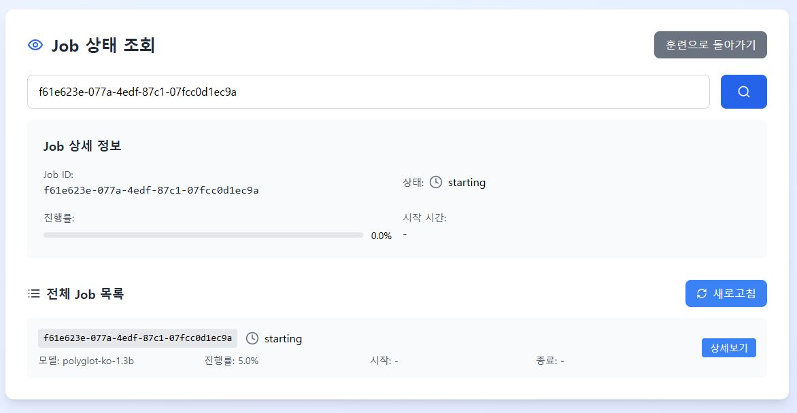

# AI 모델 파인튜닝 웹 애플리케이션

직관적인 웹 인터페이스를 통해 AI 모델을 손쉽게 파인튜닝할 수 있는 React 기반 웹 애플리케이션입니다.

## 🚀 주요 기능




### 1단계: 모델 선택
- **사전 훈련된 모델 선택**: GPT-2, BERT, DistilBERT 등
- **작업 유형 설정**: 텍스트 생성 또는 텍스트 분류
- **모델별 상세 정보 제공**

### 2단계: 데이터 업로드
- **훈련 데이터 업로드**: CSV 또는 JSON 형식 지원
- **검증 데이터 업로드**: 모델 성능 평가용 (선택사항)
- **실시간 데이터 검증**: 업로드된 데이터의 행 수 및 형식 확인

### 3단계: 훈련 설정
- **하이퍼파라미터 조정**:
  - 에포크 수 (1-100)
  - 배치 크기 (1-64)
  - 학습률 (0.00001-0.01)
  - 최대 시퀀스 길이 (64-2048)
  - 워밍업 스텝 (0-1000)
  - Weight Decay (0-0.1)
- **고급 옵션**: 그래디언트 체크포인팅

### 4단계: 훈련 실행 및 모니터링
- **실시간 진행률 표시**: 그래디언트 프로그레스 바
- **훈련 로그**: 타임스탬프와 함께 상세한 훈련 정보
- **완료 알림**: 훈련 완료 시 자동 알림

## 🛠️ 기술 스택

- **Frontend**: React 18+ with Hooks
- **UI 컴포넌트**: Tailwind CSS
- **아이콘**: Lucide React
- **상태 관리**: React useState
- **파일 처리**: FileReader API

## 📋 시스템 요구사항

- Node.js 16.0 이상
- npm 또는 yarn
- 모던 웹 브라우저 (Chrome, Firefox, Safari, Edge)

## 🔧 설치 및 실행

### 1. 저장소 클론
```bash
git clone <repository-url>
cd ai-finetuning-webapp
```

### 2. 의존성 설치
```bash
npm install
# 또는
yarn install
```

### 3. 개발 서버 실행
```bash
npm start
# 또는
yarn start
```

### 4. 브라우저에서 확인
```
http://127.0.0.1:3000
```

## 📊 지원하는 데이터 형식

### CSV 형식
```csv
input,output
"고객의 신용점수는 어떻게 계산되나요?","신용점수는 신용거래 이력, 연체 여부, 부채 비율 등을 종합적으로 평가하여 산출됩니다."
"대출 승인 기준은 무엇인가요?","소득, 신용등급, 부채비율, 담보가치 등을 종합적으로 검토하여 승인 여부를 결정합니다."
```

### JSON 형식
```json
[
  {
    "input": "고객의 신용점수는 어떻게 계산되나요?",
    "output": "신용점수는 신용거래 이력, 연체 여부, 부채 비율 등을 종합적으로 평가하여 산출됩니다."
  },
  {
    "input": "대출 승인 기준은 무엇인가요?",
    "output": "소득, 신용등급, 부채비율, 담보가치 등을 종합적으로 검토하여 승인 여부를 결정합니다."
  }
]
```

## ⚙️ 하이퍼파라미터 가이드

### 초보자 권장 설정
- **에포크**: 3-5
- **배치 크기**: 4-8
- **학습률**: 5e-5
- **최대 시퀀스 길이**: 512

### 고급 사용자 설정
- **대용량 데이터**: 배치 크기 16-32, 에포크 1-3
- **소규모 데이터**: 배치 크기 2-4, 에포크 5-10
- **긴 텍스트**: 최대 시퀀스 길이 1024-2048

## 🎯 금융 도메인 활용 사례

### 신용평가 모델
- **데이터**: 고객 신용정보와 평가 결과
- **모델**: BERT 기반 분류 모델
- **용도**: 자동 신용등급 분류

### 금융 상담 챗봇
- **데이터**: 금융 상담 질문-답변 쌍
- **모델**: GPT-2 기반 생성 모델
- **용도**: 고객 문의 자동 응답

### 리스크 분석
- **데이터**: 시장 데이터와 리스크 레벨
- **모델**: DistilBERT 분류 모델
- **용도**: 투자 상품 리스크 자동 분류

## 🔒 보안 고려사항

- **데이터 보안**: 업로드된 데이터는 브라우저 메모리에만 저장
- **개인정보 보호**: 민감한 금융 데이터 처리 시 암호화 필요
- **접근 제어**: 프로덕션 환경에서는 인증/인가 시스템 구축 권장

## 🐛 문제 해결

### 파일 업로드 오류
- CSV 파일의 인코딩이 UTF-8인지 확인
- 파일 크기가 브라우저 제한을 초과하지 않는지 확인

### 훈련 설정 오류
- 하이퍼파라미터 값이 허용 범위 내인지 확인
- 메모리 부족 시 배치 크기를 줄여서 시도

### 브라우저 호환성
- 최신 버전의 브라우저 사용 권장
- JavaScript가 활성화되어 있는지 확인

## 🔄 향후 개발 계획

### v2.0
- [ ] 백엔드 API 연동
- [ ] 실제 GPU 훈련 지원
- [ ] 모델 성능 평가 메트릭
- [ ] 훈련 이력 관리

### v2.1
- [ ] 다중 사용자 지원
- [ ] 클라우드 스토리지 연동
- [ ] 자동화된 모델 배포
- [ ] A/B 테스트 기능

## 🤝 기여하기

1. Fork the repository
2. Create your feature branch (`git checkout -b feature/AmazingFeature`)
3. Commit your changes (`git commit -m 'Add some AmazingFeature'`)
4. Push to the branch (`git push origin feature/AmazingFeature`)
5. Open a Pull Request

## 📝 라이선스

이 프로젝트는 MIT 라이선스 하에 배포됩니다. 자세한 내용은 `LICENSE` 파일을 참조하세요.

## 📞 지원 및 문의

- **이슈 제기**: GitHub Issues 페이지 활용
- **문서**: 위키 페이지 참조
- **커뮤니티**: Discussions 섹션 참여

## 🙏 감사의 말

- React 팀의 훌륭한 프레임워크
- Tailwind CSS의 아름다운 스타일링
- Lucide React의 깔끔한 아이콘
- 오픈소스 커뮤니티의 지속적인 기여

---

**주의**: 이 애플리케이션은 데모 목적으로 제작되었습니다. 프로덕션 환경에서 사용 시 추가적인 보안 및 성능 최적화가 필요합니다.